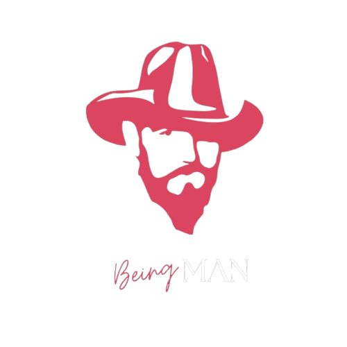
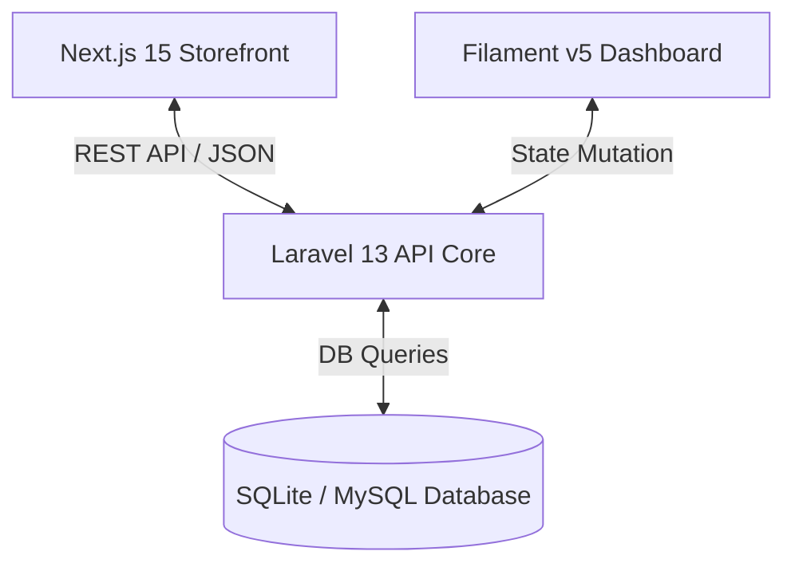

# 🎩 Being The Man — E-Commerce Book Store

<div align="center">
  <p align="center">
    
  </p>

  <h1><b>Being The Man — Digital Publishing Ecosystem</b></h1>
  <p><i>A premium, conversion-optimized landing page, checkout, and admin CMS framework built for the digital publication <b>"The Silent Language of Style"</b>.</i></p>

  <p align="center">
    <a href="https://nextjs.org"></a>
    <a href="https://laravel.com"></a>
    <a href="https://filamentphp.com"></a>
    <a href="https://tailwindcss.com"></a>
  </p>

  <p align="center">
    <a href="https://vercel.com/new/clone?repository-url=https://github.com/beingmushfiq/Being-The-Man">
      
    </a>
  </p>
</div>

---

## 📖 Table of Contents

- [Overview](#-overview)
- [Architecture & Tech Stack](#-architecture--tech-stack)
- [Key Features](#-key-features)
  - [Sales Funnel Showcase](#sales-funnel-showcase)
  - [Local Payment Gateways](#local-payment-gateways)
  - [Filament Settings Panel](#filament-settings-panel)
- [Project Directory Layout](#-project-directory-layout)
- [Local Installation](#-local-installation)
  - [Backend & CMS Setup](#1-backend--cms-setup)
  - [Frontend Storefront Setup](#2-frontend-storefront-setup)
- [Environment Variables Guide](#-environment-variables-guide)
- [Customization & Tuning](#-customization--tuning)
  - [Brand Aesthetics](#brand-aesthetics)
  - [Dynamic Pricing & Gates](#dynamic-pricing--gates)
- [License](#-license)

---

## 🌟 Overview

**Being The Man** is a premium, high-converting digital storefront designed to sell the publication **"The Silent Language of Style"** — a definitive men's confidence and style guide targeting the Bangladeshi market. 

The application utilizes a **12-section psychological sales funnel** (Hook → Pain → Agitation → Transformation → Offer → CTA) tailored for conversion, coupled with a robust Laravel and Filament-powered administrative panel supporting multiple payment pathways (bKash, Nagad, Shurjopay, AamarPay) and customer tracking utilities.

---

## 🛠️ Architecture & Tech Stack

This project is built using a modern decoupled architecture:



### Stack Highlights

* **Frontend Storefront:** **Next.js 15** & **React 19** with fully responsive Tailwind CSS v4 styling, customized Google Fonts integration ( Hind Siliguri & Playfair Display ), and interactive 3D CSS book mockup.
* **Administrative Portal:** **Filament v5** & **Laravel 13** offering settings sheets, widgets, order lists, and customer lookup tables.
* **Database & Seeders:** SQLite/MySQL backend with custom schemas containing pre-seeded default configurations.

---

## ✨ Key Features

### Sales Funnel Showcase
* **Structured Funnel Sections:** A psychological sequence taking the customer from initial hook to conversion.
* **Before/After Transform Visualizer:** Clear, high-contrast style transformation grids.
* **Testimonials & Social Proof:** Interactive customer rating panels and star selectors.
* **Adaptive FAQ Engine:** Accordion questions powered by client-side states.

### Local Payment Gateways
The backend features a unified `PaymentProviderInterface` enabling hot-swappable local gateways:
* **bKash:** Full tokenized merchant checkout flow.
* **Nagad:** Integrated mobile wallet API.
* **ShurjoPay & AamarPay:** Secure local credit card and bank transfer routing.
* **WhatsApp Ordering:** Instant fallback to chat-driven checkout links.

### Filament Settings Panel
Accessible at `/admin/manage-settings`, this sheet lets you modify the platform state instantly:
* **Store Details:** Customize names, URLs, prefixes, and currencies.
* **Product Pricing:** Live toggles for launch prices vs. standard prices.
* **API Credentials:** Direct secret inputs for bKash, ShurjoPay, Meta Pixel, WhatsApp API, and Google Tag Manager.
* **System State:** One-click maintenance-mode toggle with custom messages.

---

## 📁 Project Directory Layout

```
Being The Man/
├── v2/
│   ├── backend/                  # Laravel 13 Core & Filament v5 Panel
│   │   ├── app/
│   │   │   ├── Filament/        # Admin resources, pages, and widgets
│   │   │   ├── Models/          # Eloquent Models (Order, Setting, Product, etc.)
│   │   │   └── Services/        # Payment gateway drivers (bKash, ShurjoPay, etc.)
│   │   ├── config/              # Laravel config profiles
│   │   ├── database/            # Database migrations & SettingSeeders
│   │   ├── public/              # Public assets (logo, favicon)
│   │   └── routes/              # API & web route configurations
│   │
│   └── frontend/                 # Next.js 15 Storefront
│       ├── src/
│       │   ├── app/             # Page layouts, API routes, components
│       │   ├── components/      # Common UI (CheckoutModal, Book3D)
│       │   └── content.ts       # Fallback pricing & static catalog data
```

---

## 🚀 Local Installation

### 1. Backend & CMS Setup
Ensure you have PHP 8.2+ and Composer installed.

1. Navigate to backend:
   ```bash
   cd v2/backend
   ```
2. Install Composer dependencies:
   ```bash
   composer install
   ```
3. Create local environment configuration:
   ```bash
   cp .env.example .env
   php artisan key:generate
   ```
4. Set up the database (using SQLite by default):
   ```bash
   touch database/database.sqlite
   php artisan migrate --seed
   ```
5. Start development server:
   ```bash
   php artisan serve
   ```
   Admin panel will be accessible at: `http://localhost:8000/admin` (Default: `admin@example.com` / `password`).

### 2. Frontend Storefront Setup
Ensure you have Node.js v18+ installed.

1. Navigate to frontend:
   ```bash
   cd v2/frontend
   ```
2. Install Node packages:
   ```bash
   npm install
   ```
3. Copy local environment variables:
   ```bash
   cp .env.example .env.local
   ```
4. Spin up Next.js:
   ```bash
   npm run dev
   ```
   Storefront will be accessible at: `http://localhost:3000`.

---

## 🔐 Environment Variables Guide

### Backend Configuration (`v2/backend/.env`)
```env
APP_NAME="Being The Man"
APP_ENV=local
APP_KEY=base64:xxx
APP_URL=http://localhost:8000

DB_CONNECTION=sqlite
# If using mysql:
# DB_CONNECTION=mysql
# DB_HOST=127.0.0.1
# DB_PORT=3306
# DB_DATABASE=being_the_man
```

### Frontend Configuration (`v2/frontend/.env.local`)
```env
NEXT_PUBLIC_API_URL=http://localhost:8000/api
NEXT_PUBLIC_APP_URL=http://localhost:3000

# Payment Gateways (falls back to DB settings when integrated)
BKASH_BASE_URL=https://checkout.sandbox.bka.sh/v1.2.0-beta
BKASH_APP_KEY=sandbox_key
BKASH_APP_SECRET=sandbox_secret
BKASH_USERNAME=sandbox_user
BKASH_PASSWORD=sandbox_pass
```

---

## 🎨 Customization & Tuning

### Brand Aesthetics
You can edit the primary styling configuration values and brand styles in the custom Tailwind setup in the frontend:
* **Backgrounds:** `--color-bg-deep: #050A18`
* **Accents:** `--color-primary: #D4AF37` (Gold Accent)
* **Fonts:** Configured via `google/fonts` in [page.tsx](file:///d:/Being%20The%20Man%20%E2%80%94%20E-Commerce%20Book%20Store/v2/frontend/src/app/page.tsx).

### Dynamic Pricing & Gates
Pricing definitions can be updated dynamically via [ManageSettings.php](file:///d:/Being%20The%20Man%20%E2%80%94%20E-Commerce%20Book%20Store/v2/backend/app/Filament/Pages/ManageSettings.php) inside the Filament dashboard, which writes directly to the `settings` database table and instantly propagates values to the storefront via the public API `/api/settings/public` endpoint.

---

## 🔒 License

This project is proprietary software owned by **Being The Man**.  
All rights reserved. Unauthorized copying, distribution, or modification is prohibited.

<div align="center">
  <br />
  <p><b>Built with ❤️ for Being The Man</b></p>
  <p>
    <a href="https://www.facebook.com/beingtheman">Facebook</a> • 
    <a href="https://www.instagram.com/beeingman/">Instagram</a> • 
    <a href="https://beingman.gumroad.com/l/stylelanguage">Gumroad</a>
  </p>
</div>
